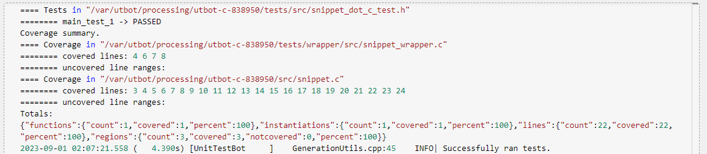
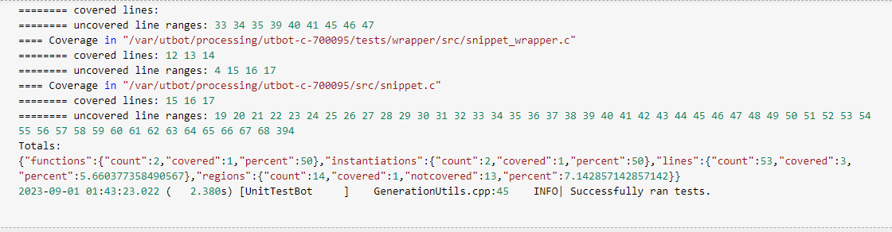

# UnitTestBotCCpp Tutorial and Testing

## Guia Rápido 
- [What is](#WhatIs)
- [A Tool Ready To Use](#AToolReadyToUse)
- [Testing the test](#TestingTheTest)
- [Target](#Target)
- [Features](#Features)
- [Worth it?](#Worthit?)
- [Where It Came From?](#WhereItCameFrom?)

## What is
UnitTestBot (aka UTBot) tool provides engineers with a simple 1-mouse-click way to automatically generate unit tests and visualize coverage for projects written in C and C++ Programming Languages. It is an IDE extension (the client) paired with server application. The tool uses symbolic execution for test cases generation. UTBot uses KLEE Symbolic Virtual Machine enchanced with a new advanced bidirectional symbolic execution algorithm developed by Research Group from Saint Petersburg State University. Tests are generated in form of Google Test Framework.

## A Tool Ready To Use
You can try drectly online here: https://www.utbot.org/demo

Or 

Use the tool in your VS Code following the guide : https://github.com/UnitTestBot/UTBotCpp/wiki/Intro

## Testing the test

To test the capabilities and limitations of the tool, two RPM increment codes were developed, aiming to simulate this task in an automotive ECU. The first code is called rpm_simple is based on a simple value increment.The second includes additional elements such as correction and error factors, And it is called as rpm_max. 

Both codes were subjected to the automatic test case generation tool, and their codes can be seen in this directory as test_rpm_max and test_rpm_simple.

The test for the rpm_simple code achieved 100% coverage for the applied basic function.

On the other hand, the rpm_max code managed to complete the tests with just over 7% overall coverage. This is attributed to issues within the automatic code generation itself, such as extensive loops, code architecture, and function clarity.

## Target

Assisting programmers who don't engage in software testing, and for those who do, serving as a tool for comparison.

## Features
Tests Generation - Regression Suite: UnitTestBot generates test cases by code, trying to cover maximum statements and execution paths. We treat source code as source of truth assuming that behavior is correct (corresponds to initial user demand). Generated tests are placed in the so-called regression suite. Thus, we fixate current behavior by test cases.What is the purpose? You obtain full control of future code changes. Any code change now can't break behavior silently. If developer changes the code, then some tests will fall on CI. UTBot provides dramatic code quality improvement in the long term: after tests are generated no change can break behavior without an alarm.

Test Generation - Errors Detection: UnitTestBot is not only able to fixate the behavior in an existing code, but it also helps to find real bugs in your project. Some code fragments might be invalid, while developers don't know about it. For example, buffer overflows, assertion failures, segmentation faults, and so on. If UTBot finds an execution path leading to such a situation, it creates a special test case that is added to the so-called error suite.While all tests from regression suite are green right after generation, tests from error suite are red (they fail if you run them). Such tests generated by UnitTestBot are a convenient way to discover critical problems as soon as possible. After developer fixes a bug, tests can be rerun to verify the problem is gone.

Code Coverage: Of course, in an ideal world we would like to test every execution path of the program (so-called path coverage), but the number of such paths is often infinite due to loops and recursion. UnitTestBot aims to maximize other types of coverages: statement coverage and branch coverage, most commonly used as metrics for coverage quality assessment tools.

## Worth it?
The ease and swiftness of the tool also become an issue. Automatically generated tests adhere to the guidelines of an algorithmic foundation over which the user has no control, and if the user decides to modify any of the manual tests, the execution time ends up being tripled and failures commonly occur. Therefore, UTBot is employed for less critical day-to-day tests in a supplementary manner to a programmer's primary tasks.

## Where It Came From?
How they refer to themselves, a distributed team of researchers and engineers build the UTBot.
For more information, visit the source of all of the info above:
https://github.com/UnitTestBot/
